# Описание датасетов

| Название | [Electricity Transformer Dataset](https://github.com/zhouhaoyi/ETDataset) — поднабор ETT-small — вариант h (агрегированные почасовые данные) |
| --- | --- |
| Содержание | измерения с 2 электротрансформаторных подстанций в одном из регионов Китая. |
| Область применения | анализ и прогнозирование временных рядов в энергетике |
| Период наблюдений | с июля 2016 по июль 2018 (~2 года) |
| Основная целевая переменная датасета | OT (Oil Temperature) — температура масла в электротрансформаторе |
| Количество записей | 17 420 |

| Поле | Тип | Описание |
| --- | --- | --- |
| date | datetime | Дата и время записи наблюдения. |
| HUFL | float | High Useful Load — высокая полезная нагрузка трансформатора. |
| HULL | float | High Useless Load — высокая «бесполезная» нагрузка трансформатора. |
| MUFL | float | Middle Useful Load — средняя полезная нагрузка трансформатора. |
| MULL | float | Middle Useless Load — средняя «бесполезная» нагрузка трансформатора. |
| LUFL | float | Low Useful Load — низкая полезная нагрузка трансформатора. |
| LULL | float | Low Useless Load — низкая «бесполезная» нагрузка трансформатора. |
| OT | float | Oil Temperature — температура масла трансформатора (целевая переменная). |

# Informer + optuna

Архитектура для долгосрочного прогнозирования временных рядов на основе Transformer-подобной модели с ProbSparse Attention

Количество итераций optuna - 5
## Сетка параметров
| Параметр | Значения | Описание |
| --- | --- | --- |
| d\_model | [128, 192, 256] | размерность эмбеддингов |
| n\_heads | [2, 4] | число голов внимания |
| e\_layers | [1, 2] | число слоёв энкодера |
| d\_layers | [1, 2] | число слоёв декодера |
| factor | [1, 3, 5] | параметр ProbSparse |
| dropout | [0.05, 0.1, 0.2] | дропаут |
| learning\_rate | [0.0001, 0.0003, 0.001] | скорость обучения |
| batch\_size | [16, 32, 64] | размер батча |
| epochs | [5, 10] | количество эпох |

## Метрики
| ETTh1 | Обучающая | Валидационная |
| --- | --- | --- |
| 5 000 |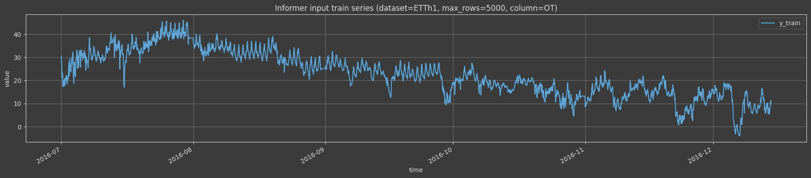|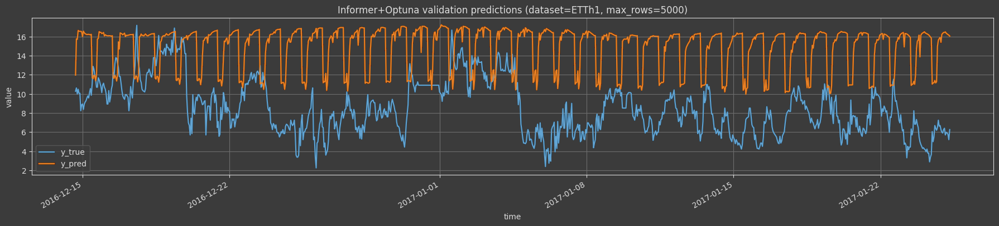|
| 10 000 |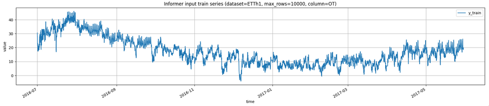|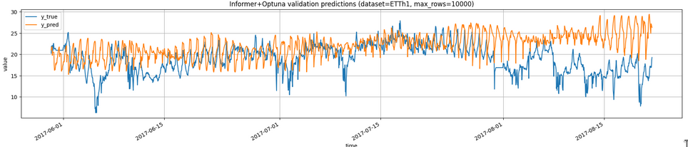|
| 17 420 |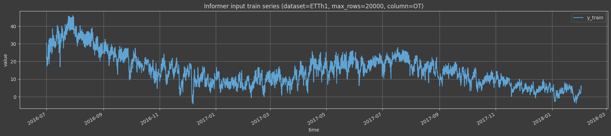|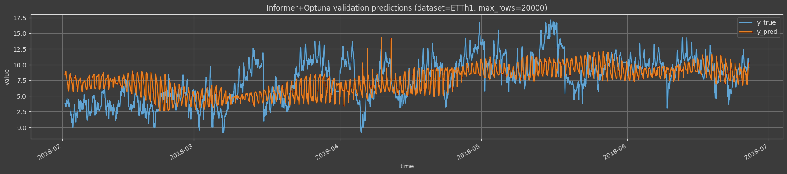|

| ETTh2 | Обучающая | Валидационная |
| --- | --- | --- |
| 5 000 |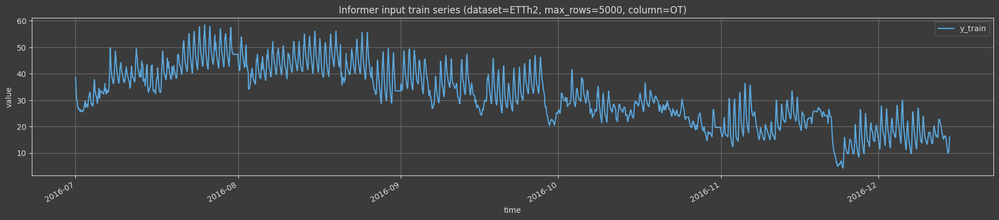|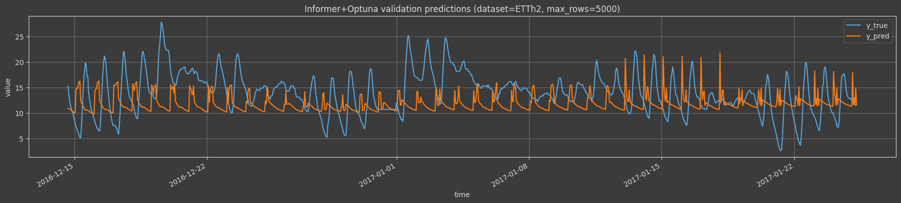|
| 10 000 |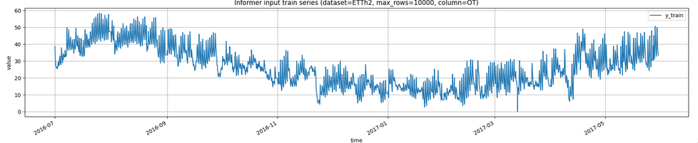|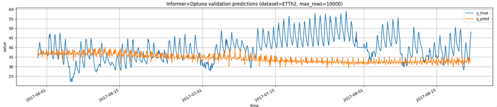|
| 17 420 |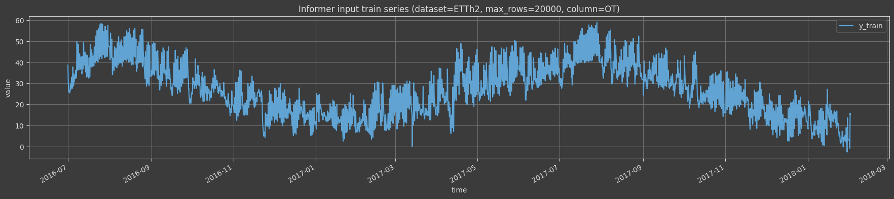|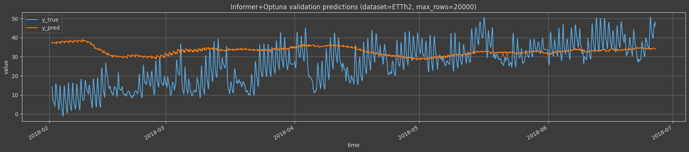|

# LLM агент

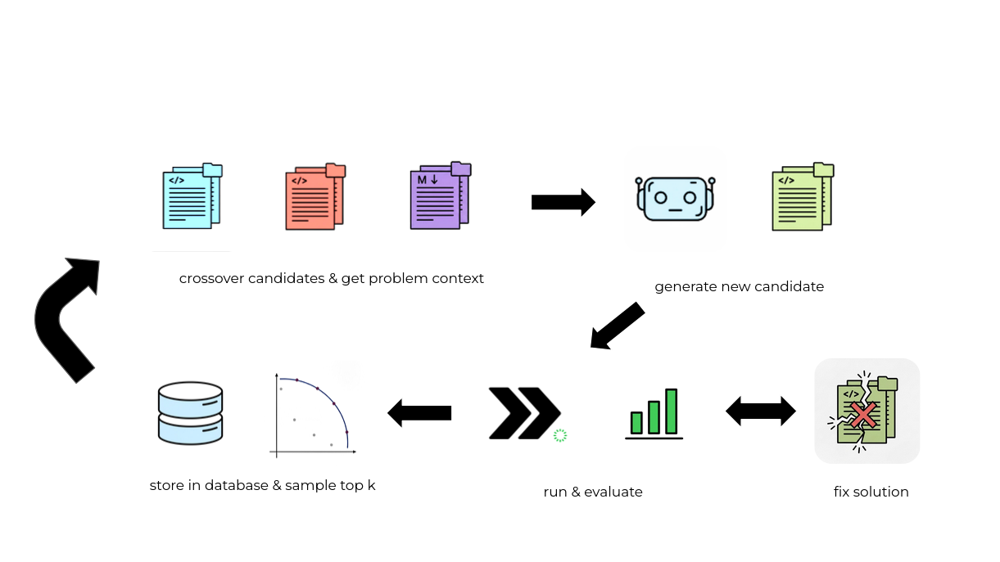

## Параметры

LLM модель - Gemini-2.5-flash

Temperature - 0.1

Top_p - 0.95

Количество эпох обучения кандидатов - 5

Начальных кандидатов  - 5

Максимальное число исправлений - 10

Итераций скрещивания - 50

## Метрики

| h1 | Валидационная |
| --- | --- |
| 5 000 |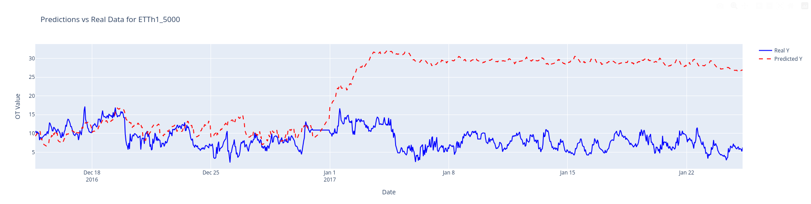|
| 10 000 |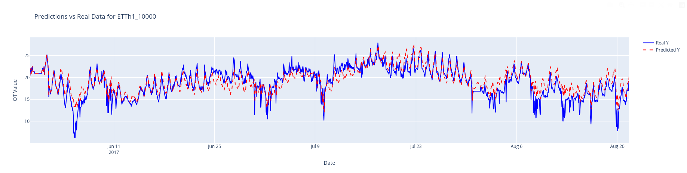|
| 17 420 |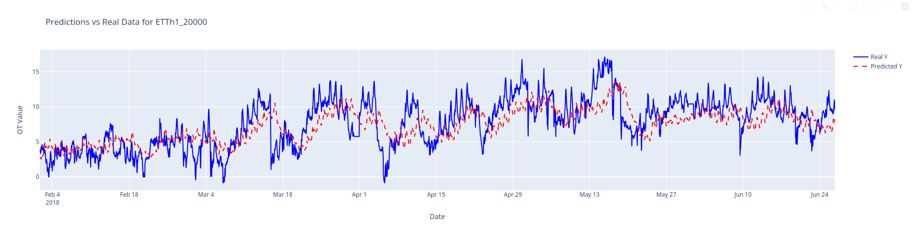|

| h2 | Валидационная |
| --- | --- |
| 5 000 |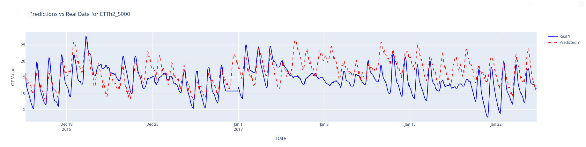|
| 10 000 |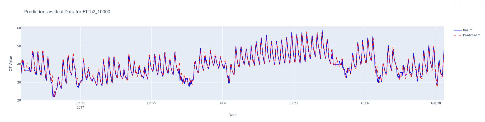|
| 17 420 |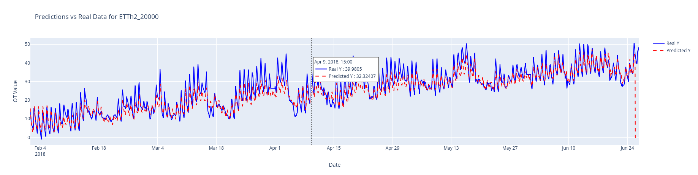|

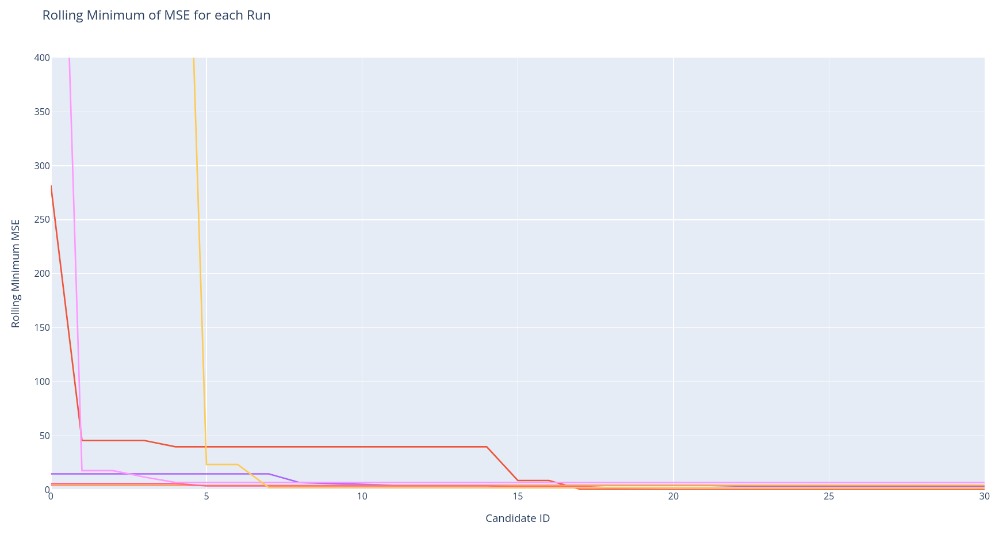

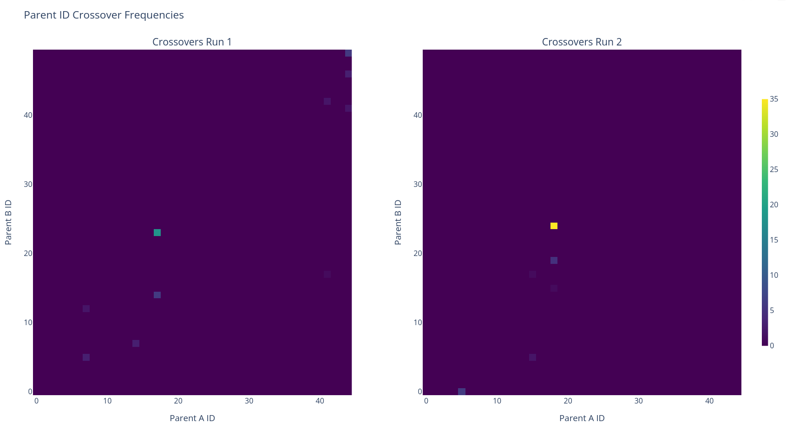

# Сравнение по MSE
| h1 | Informer | LLM агент |
| --- | --- | --- |
| 5 000 | 54.203 | 264.752 |
| 10 000 | 29.014 | 3.261 |
| 17 420 | 9.584 | 5.986 |

| h2 | Informer | LLM агент |
| --- | --- | --- |
| 5 000 | 26.958 | 24.097 |
| 10 000 | 87.68 | 1.847 |
| 17 420 | 177.557 | 25.751 |

# Архитектура Проекта

### `src/` - Исходный код

Основная папка, содержащая всю логику приложения.

*   **Jupyter notebooks (`.ipynb`):** Интерактивные ноутбуки для экспериментов и анализа.
    *   `etth_informer_optuna_experiments.ipynb`: Исследования и оптимизация модели Informer с использованием Optuna.
    *   `etth_llm_agent_experiments.ipynb`: Эксперименты с LLM агентом для поиска архитектур.

*   **`edlm_search/`**: Ядро проекта, где реализована система поиска на основе LLM.
    *   `agent/`: Центральный компонент, управляющий процессом поиска. Он генерирует, тестирует и улучшает модели-кандидаты.
        *   `llm_clients/`: Модули для взаимодействия с различными LLM API (OpenAI, DeepSeek и др.).
        *   `prompts/`: Jinja-шаблоны промптов, используемые для генерации кода моделей, их исправления и кроссовера.
        *   `ett_evaluator.py`: Логика для оценки производительности моделей на датасете ETT.
        *   `llm_search_agent.py`: Главный класс, оркестрирующий весь процесс поиска.
    *   `baselines/`: Реализации базовых моделей (LSTM, Informer) для сравнения с результатами поиска. Используются для оценки эффективности найденных LLM-агентом решений.
    *   `experiments/`: Инфраструктура для управления экспериментами, включая работу с наборами данных и сохранение артефактов.

*   **`Informer2020/`**: Полная реализация модели Informer. Этот модуль используется в качестве одной из базовых моделей (`baselines`) для оценки качества. Он включает в себя собственный загрузчик данных, слои модели и скрипты для запуска.

*   **`ETDataset/`**: Набор данных Electricity Transformer Temperature (ETT), используемый для обучения и тестирования всех моделей в этом проекте.

### `docs/` - Документация

В этой папке находится дополнительная документация, описывающая ключевые аспекты проекта, такие как используемые наборы данных и детали реализации.

# Презентация проекта
[ссылка](https://docs.google.com/presentation/d/1Rxj7sqq9UvlKhm1kXWZNX2Pd3pO7Xn6b/edit?usp=sharing&ouid=101197099842557417123&rtpof=true&sd=true)
